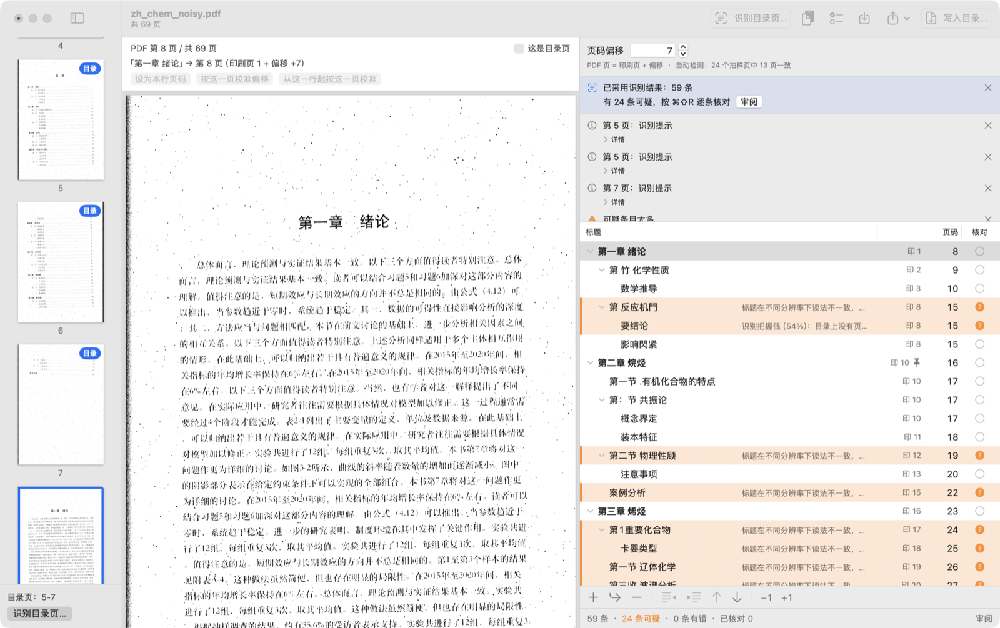

# Mulu 图形界面 v0.1

Mulu.app 是 Mulu 的 Mac 图形界面：打开一本 PDF，把目录整理对，再另存成一份带目录的新 PDF。原文件一个字节都不改。

为什么要有它：在 17 本真实扫描书上，`mulu auto` 只在 1 本上自动写出了目录（见 [REALSCAN.md](REALSCAN.md)）。所以界面不追求「一键成功」，而是**先给出草稿，再让人快速改对**：点一行，预览立刻跳到那一页；改偏移，所有页码立刻跟着变；写入时走和 `mulu apply` 相同的写入器，写完再从磁盘读回来核对。



截图是合成扫描书 `zh_chem_noisy`（故意做得很脏）识别目录页 5–7 之后的样子：59 条里 24 条标为可疑，原因直接写在标题后面。

## 它能做什么

- 打开 PDF：拖进窗口、⌘O，或在 Finder 里用「打开方式」。一个窗口一本书。
- PDF 里已经有目录的，自动载入，可以直接改。
- 扫描书：标出印着目录的那几页，让 Mulu 用 macOS 自带的 Vision 识别成草稿，并自动找页码偏移。
- 也可以粘贴目录文字（从豆瓣、书店页面、电子书里复制），或导入目录文件（Mulu 文本、PDF补丁丁 XML、pdfdir、OPML、JSON）。
- 改草稿：改标题、改页码、调层级、上移下移、增删条目；全局偏移、从某一章起的分段偏移；每一步都能撤销。
- 审阅模式：逐条核对可疑条目，预览跟着跳页。
- 写入：总是写成新文件，默认名 `<原名>-目录.pdf`。新文件 = 原文件的全部字节 + 末尾追加的目录。
- 导出目录为上面五种格式之一。

全部在本机完成，不联网。

## 构建和运行

需要 macOS 14 或更新、Swift 6 工具链。我们只用 Xcode 27（Swift 6.4）构建过；打包脚本需要 Xcode 27，因为更早的 SwiftPM 构建方式不编译 String Catalog，脚本会报错停下。不需要 Homebrew，也不需要 Xcode 工程：App 是 SwiftPM 的一个可执行目标（`MuluApp`）。

**直接从源码运行**（开发时用）：

```bash
swift run MuluApp
```

这样运行没有 App 包，界面显示中文原文（英文翻译只在打包后的 App 里生效）。

**打包成 Mulu.app**：

```bash
scripts/package_app.sh            # 生成 dist/Mulu.app 和 dist/Mulu-0.1.0-macos-arm64.zip
open dist/Mulu.app
```

脚本做的事：`swift build -c release --product MuluApp` → 组装 App 包（可执行文件、资源、图标、Info.plist）→ ad-hoc 签名 → 压成 zip 并打印 SHA-256。用 `--version 0.1.1` 改版本号，`--skip-build` 跳过构建。release 构建在 M5 Pro 上不到 1 分钟。

App 图标是 `scripts/make_icon.swift` 用 CoreGraphics 画的，生成的 `Sources/MuluApp/Resources/AppIcon.icns` 已经提交，打包时直接复制。只有改图标时才需要重新运行 `swift scripts/make_icon.swift`。

**重新生成 README 顶上的动图**（只有界面变了才需要）：

```bash
scripts/package_app.sh
uv run --python 3.12 scripts/make_demo_gif.py     # 写到 docs/images/demo.gif
```

脚本用烟雾模式（`MULU_SMOKE_STOP=marked|result|review`，见 [GUI_SPEC.md](GUI_SPEC.md) §9.3）让 App 停在每个阶段，用 `screencapture -l` 截窗口，再拼成 GIF。需要 `Fixtures/books`（`tools/run_all.sh --books` 会生成）和终端的「屏幕录制」权限；运行时前台要是普通桌面，不能是全屏 App。

界面语言跟随系统。想强制中文：

```bash
open dist/Mulu.app --args -AppleLanguages "(zh-Hans)"
```

**关于签名**：App 只有 ad-hoc 签名，没有 Developer ID，也没有公证。

- 自己在本机构建的 App 可以直接打开。
- 从别处下载的 zip 解压后，系统会拦住。macOS 14：在 Finder 里右键点 App ▸ 打开 ▸ 再点「打开」。macOS 15 及以后：先双击一次（会被拦），再到「系统设置 ▸ 隐私与安全性」里点「仍要打开」。
- 下载后被拦的这条路径我们没有实测过，只测了本机构建。

## 窗口

| 区域 | 内容 |
|---|---|
| 左栏：缩略图 | 每页一张。点一下预览这一页；按住 ⌘ 点一下，标为目录页（再点取消）。底部显示已选的目录页和「识别目录页…」按钮。 |
| 中栏：预览 | 上面一条栏：当前是 PDF 第几页、「这是目录页」勾选框、选中条目指向哪一页、三个校正按钮。下面是 PDF 页面。 |
| 右栏：目录草稿 | 页码偏移、提示横幅、识别提示、目录表格（标题 / 页码 / 核对）、审阅栏、行按钮、计数。 |

表格里每行的页码列：灰色小字「印 12」是书上印的页码，右边的数字是 PDF 的物理页。图钉表示这一行的页码是手动固定的，不随偏移变。「印 12 ·+2」表示这一行在全局偏移之外还多移了 2 页（分段偏移）。

行的底色和核对列的图标表示状态：

| 状态 | 样子 | 含义 |
|---|---|---|
| 正常 | 空心圆 | 没发现问题，也没人核对过 |
| 可疑 | 橙色底、问号 | 识别把握低、页码顺序不对等；原因写在标题后面，鼠标停在核对列上能看到全部原因 |
| 有错 | 红色底、三角 | 没有页码、标题是空的、页码超出范围；有错的行没改好之前不能写入 |
| 已核对 | 绿色对勾 | 你确认过这一行 |

## 主要流程

### 1. 扫描书：识别印刷目录

1. 打开 PDF。右栏写着「这个 PDF 还没有目录」。
2. 在预览里翻到印着目录的页，逐页勾选预览上方的「这是目录页」（⌘⇧T）。也可以按住 ⌘ 点左边的缩略图。
3. 点「识别目录页…」（⌘R）。目录页范围已经填好，也可以手输，例如 `5-7` 或 `3,5,8-9`；用中文输入法打出的 `３，５，８－９`、`5～7`、`5至7` 也认。
4. 如果你知道书上印着「1」的那一页是 PDF 第几页，填进去；不知道就留空，Mulu 会抽样正文页自己找偏移。
5. 识别在后台进行，有进度，可以取消。目录页每页大约 1 秒，找偏移 2–5 秒。
6. 结果面板告诉你识别出多少条、多少条可疑、偏移是怎么来的，以及把握够不够。选「使用结果」（草稿为空时）或「替换当前目录 / 追加到末尾 / 插入到选中行之后」。
7. 没读出任何条目时，「使用」类按钮是灰的，回车回到表单改页码再试，不会把已有草稿清空。

单独识别某一页：右键点缩略图 ▸「只识别这一页…」。

### 2. 已有目录文字：粘贴或导入

- 「粘贴目录文字…」（⌘⇧V）：在文本框里按 ⌘V。每行一条，末尾是印刷页码；缩进和「第X章」这类编号用来推断层级。可以让 Mulu 自动找偏移。
- 「导入目录…」（⌘⇧I），或把目录文件拖进窗口：Mulu 文本、PDF补丁丁 XML、pdfdir、OPML、JSON。格式自动判断，也可以在面板里指定。文件最大 20 MB。
- pdfdir 文本里的页码是印刷页码，导入后偏移是 0。偏移栏会用橙色字提醒你还没设偏移。

### 3. 把草稿改对

核心动作：**点一行，看预览**。预览跳到这一行指向的页，看这一页是不是真的从这一章开始。

页码不对时，把预览翻到这一章真正的第一页（滚动，或 ⌥← / ⌥→），然后三选一：

| 按钮（预览上方） | 快捷键 | 作用 | 什么时候用 |
|---|---|---|---|
| 设为本行页码 | ⌘L | 只把这一行固定到当前预览页 | 只有这一行不对 |
| 按这一页校准偏移 | ⌘⇧L | 改全局偏移，让这一行落在当前预览页，其他行一起动 | 所有行都差同样的页数 |
| 从这一行起按这一页校准 | ⌥⌘L | 只移动这一行和它后面的行，前面的不动 | 书中间夹了没有页码的插页，从某一章起开始错开 |

其他改法：

- 直接改偏移：右栏顶上的「页码偏移」。PDF 页 = 印刷页 + 偏移。
- 选中几行后按 `]` / `[`：页码 +1 / −1；`}` / `{`：±10。想移动「这一行到末尾」，用「目录 ▸ 选中本行到末尾」再按 `]`。
- 改标题：回车或 ⌘E，或双击。改页码：双击页码，或编辑标题时按 Tab 跳过去。Esc 放弃。
- 调层级：Tab / ⇧Tab。上移下移：⌥⌘↑ / ⌥⌘↓（连同子条目一起移）。
- 添加：⌘↩ 同级，⌘⇧↩ 子条目，新条目指向当前预览页。删除：⌫；⌥⌘⌫ 只删这一行，保留它的子条目。
- 找问题行：点表格下方的「N 条可疑」「N 条有错」，或按 ⌘'，跳到下一条。
- 撤销 / 重做：⌘Z / ⌘⇧Z，保留最近 200 步。撤销「使用识别结果」或「导入」时，相应的提示和横幅也一起撤回。

### 4. 审阅

「审阅」（⌘⇧R）逐条走一遍。有可疑条目时默认只看可疑的。

- ↓ / ↑：下一条 / 上一条，预览跟着跳。
- ↩：标为已核对并前往下一条。有错的行不能核对，要先改好。
- Esc：退出审阅。
- 审阅栏在表格下面，写着这一条为什么可疑；「详情」里是识别器的英文原话。
- 审阅时点预览、滚动预览都可以，键盘焦点会回到表格，↓ ↑ ↩ 一直有效。
- 可疑的都看完后，Mulu 会告诉你还有多少条没看过（错字不一定被标成可疑），可以接着看其余的。

### 5. 写入

「写入目录…」（⌘S）。

1. 有错的行会列出来，可以直接定位到第一条。
2. 还有可疑条目没核对时会问一句，默认按钮是「先审阅」；「仍然写入」要用鼠标点。
3. 保存面板，默认名 `<原名>-目录.pdf`。选原文件本身会被拒绝（通过符号链接、硬链接指向原文件也一样）。
4. 写入过程：确认原文件打开后没被改过 → 用 `Mulu.apply` 生成输出并自检 → 写到输出位置旁边的临时文件 → 从磁盘读回来，核对前面的字节和原文件逐字节相同、目录和草稿一致 → 通过后才改名到你选的位置。任何一步失败都不会留下文件，你选择替换的旧文件也不会被动。
5. 成功后横幅显示文件名、书签数和追加了多少字节，可以在 Finder 里显示或直接打开。

顶层标题以 `#` 开头时，写进 PDF 的是全角 `＃`（Mulu 文本格式里行首的 `#` 表示注释）。这样的行会有一条提示，不挡写入。

### 6. 关窗口和退出

- 草稿有没写入的修改时，关窗口和退出都会先问，默认按钮是「取消」。
- 正在写入时不能关窗口、不能退出，等写完。
- v0.1 没有草稿自动保存。想留着草稿，先用「导出目录 ▸ Mulu 文本」存一份，下次导入。

## 快捷键

「帮助 ▸ 键盘快捷键」（⌘?）里有同一张表。表格里的单键（标「表格」的）只在表格有焦点、没在改文字时生效；右键菜单里也标着这些键。

| 操作 | 快捷键 |
|---|---|
| 新窗口 / 打开 PDF… / 关闭窗口 | ⌘N / ⌘O / ⌘W |
| 写入目录… | ⌘S |
| 导入目录… / 导出目录（上次的格式）… | ⌘⇧I / ⌘⇧E |
| 粘贴目录文字… | ⌘⇧V |
| 识别目录页… | ⌘R |
| 标为目录页（当前预览页） | ⌘⇧T |
| 审阅模式 开 / 关 | ⌘⇧R |
| 下一条可疑 | ⌘' |
| 预览上一页 / 下一页 | ⌥← / ⌥→ |
| 设为当前预览页 | ⌘L |
| 按当前预览页校准偏移 | ⌘⇧L |
| 从这一行起按当前预览页校准 | ⌥⌘L |
| 编辑标题 | ↩（表格）、⌘E、双击 |
| 编辑时跳到页码 / 回到标题 | Tab / ⇧Tab |
| 增加缩进 / 减少缩进 | Tab / ⇧Tab（表格）、⌘] / ⌘[ |
| 选中行页码 +1 / −1 | `]` / `[`（表格）、⌃⌘] / ⌃⌘[ |
| 选中行页码 +10 / −10 | `}` / `{`（表格） |
| 上移 / 下移 | ⌥⌘↑ / ⌥⌘↓ |
| 添加同级条目 / 添加子条目 | ⌘↩ / ⌘⇧↩ |
| 删除（连同子条目） | ⌫（表格）、⌘⌫ |
| 删除但保留子项 | ⌥⌘⌫ |
| 标为已核对（切换） | 空格（表格）、⌘K |
| 展开 / 折叠 | → / ←（表格）；按住 ⌥ 点三角 = 全部 |
| 审阅：下一条 / 上一条 / 确认并下一条 / 退出 | ↓ / ↑ / ↩ / Esc |
| 撤销 / 重做 | ⌘Z / ⌘⇧Z |
| 键盘快捷键表 | ⌘? |

## 测试结果

2026-09-30，Apple M5 Pro，macOS 26.6.2，Xcode 27。全部用 `nice -n 15` 在后台跑。

| 检查 | 结果 |
|---|---|
| `swift build -c release` | 通过 |
| `swift test` | 240 个测试全部通过：MuluCore 132、MuluOCR 56、MuluAppModel 52 |
| `tools/run_all.sh` | 31/31 + 47/47，`ALL PASS`（写入器行为没有改动） |
| `scripts/package_app.sh` | 生成 `dist/Mulu.app`（5.4 MB，arm64，带图标）和 zip（2.0 MB），签名校验通过 |
| `scripts/smoke_app.sh --app dist/Mulu.app` | 18/18 |
| `scripts/check_strings.py` | 362 条中文界面文字都有英文翻译 |

烟雾测试（`MULU_SMOKE` 模式，App 在后台启动、跑完自己退出）的五段：

| 段 | 内容 | 结果 |
|---|---|---|
| A | 打开已有目录的 PDF → 写入 → 输出以原文件字节开头 | 通过 |
| B | 合成扫描书识别目录页 4–5：至少 30 条，偏移 +6 | 通过 |
| C | Finder 式打开（`open -a Mulu.app 文件`）：恰好一个窗口 | 通过 |
| D | 中文、英文界面各启动一次 | 通过 |
| E | 关窗口后，会话、模型、PDFKit 文档、缩略图渲染器都被释放 | 通过 |

界面层（SwiftUI 视图、AppKit 表格）没有单元测试目标，能放进模型的逻辑都放进了 `MuluAppModel` 并有测试。

### 这一轮评审修了什么

评审共 33 条：重要 12 条，次要 21 条。全部处理了，下面是和使用有关的：

- **编辑中的文字不再写错行**：标题或页码还在编辑时点了表格下面的按钮、折叠了别的行、或撤销，以前打的字可能落到另一行。现在编辑和行的身份绑定，表格重排前先把字提交给原来那一行。
- **关窗口真的释放文档**：实测发现 macOS 26 上 SwiftUI 会把关掉的窗口藏起来留着，不更新它的视图，整本书（PDF、缩略图缓存）一直占着内存。现在关窗口时先放掉文档、等界面拆完再关。烟雾 E 段专门查这一点。
- **损坏的 PDF 不再转圈**：Mulu 自己的解析器能读、但 PDFKit 打不开的文件，预览区会说明「预览不可用」，仍然可以粘贴或导入目录再写入。打开 PDFKit 文档也不再卡住主线程。
- **写入更稳**：先核对临时文件再改名（以前是先改名再核对，核对失败会删掉你选择替换的旧文件）；核对时拿草稿比对，而不是拿生成的中间文本比对；内存峰值从约 4 倍文件大小降到约 2 倍（按代码里的拷贝次数估算，没有实测）。
- **预览上方的信息栏不再盖住页面顶部**（章标题就在那里）；审阅栏不再盖住正在审阅的行。
- **新增「从这一行起按这一页校准」**，对付偏移在书中间改变的书；分段偏移在页码列里看得见。
- **目录页更好找**：预览上方有「这是目录页」勾选框；空草稿页面分两步引导。
- **确认框的默认按钮都是安全的那个**：回车是「先审阅」「取消」，不是「仍然写入」「仍然退出」。
- **可疑原因说中文**，直接显示在标题后面；不再出现 `mulu auto`、`--toc-out` 这类命令行字眼。
- **只看可疑的审阅结束后**，不再说「全部看完了」，而是告诉你还有多少条没看过。
- ⌘⇧T 不再被系统的「显示标签页栏」抢走（关掉了窗口标签页）。
- 其他：空的识别结果不能替换草稿；写入期间表格不能改；导入文件有大小上限并在后台读；缩略图缓存按字节限制在 30 MB，滚过去的页不再排队渲染；粘贴面板不再自己读剪贴板；VoiceOver 能读出可疑原因、层级和审阅进度。

### 没有实测的部分

这台机器上的自动化进程没有「辅助功能」权限，不能替人按键、点按钮，也不能读取菜单。所以下面这些只通过读代码和模型测试确认，**没有在真实界面上操作验证**，第一次用时请留意：

- 表格里的键盘操作和行内编辑（包括上面「编辑中的文字不写错行」的修复）。
- 审阅时点了预览之后键盘焦点回到表格。
- 确认框的默认按钮、⌘⇧T、右键菜单里显示的按键。
- VoiceOver 的朗读内容。
- 所有窗口都关掉之后，再从 Finder 打开文件。

## 已知限制

- **没有公证，只有 ad-hoc 签名**，见上面「关于签名」。只有 arm64，没有通用二进制。
- **自动识别在真书上很弱**（17 本里 1 本自动成功）。界面的价值在改草稿，不在一键成功。竖排目录、老式英文目录基本要手工录入或粘贴。
- **偏移在书中间改变时不会自动发现**，只会提示「偏移可能在书中间改变」，要自己找到错开的那一章，用「从这一行起按这一页校准」。
- **不能覆盖原文件**，总是另存。加密的 PDF 不能打开。
- **没有草稿自动保存**，关窗口就丢（会先问）。
- 印刷页码那一列不能直接改；不能拖动排序。
- 写入时内存大约是文件大小的 2 倍（估算）。测试用的书最大几十 MB，几百 MB 以上的扫描书没测过。
- 目录页一次最多选 40 页；导入的目录文件最大 20 MB；撤销保留 200 步。
- PDFKit 打不开的损坏文件没有预览和缩略图，也不能识别目录页，只能粘贴或导入目录后写入。
- 英文界面有完整翻译，但识别器给出的「详情」原话只有英文。
- 只在一台 Apple M5 Pro、macOS 26.6.2 上开发和测试过。macOS 14、15 上没有跑过。

设计规格和实现记录见 [GUI_SPEC.md](GUI_SPEC.md)（写在评审之前，个别文案和布局以本文为准）。
